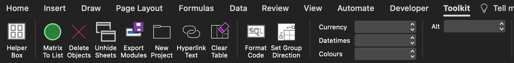

> [!NOTE]
>
> This is not actively maintained.

# VBA Projects

Core projects using Visual Basic for Applications.

> VBA documentation can be found at:
>
> - [https://learn.microsoft.com/en-us/office/vba/language/reference/user-interface-help/visual-basic-language-reference](https://learn.microsoft.com/en-us/office/vba/language/reference/user-interface-help/visual-basic-language-reference)

This repo has 3 core projects:
* [Daily Tracker](daily-tracker) for automated timesheet recording (deprecated, see [daily-tracker](https://github.com/Bilbottom/daily-tracker))
* [Outlook](outlook) for ways to automate Outlook using its VBA
* [Personal Toolkit](personal-toolkit) which is a custom Excel add-in with various quality of life features

### Daily Tracker

> Deprecated. See the following instead:
>
> - https://github.com/Bilbottom/daily-tracker

### Outlook

Details to be added

### Personal Toolkit

The personal toolkit has a lot of features under the hood, and the most helpful ones have been added to a custom ribbon by using the **Office RibbonX Editor** available at:

- [https://github.com/fernandreu/office-ribbonx-editor](https://github.com/fernandreu/office-ribbonx-editor)

The custom ribbon is called **Toolkit** and has the following features:

Most of them do what you'd expect based on their names, and the details for the others will be added in a future release
